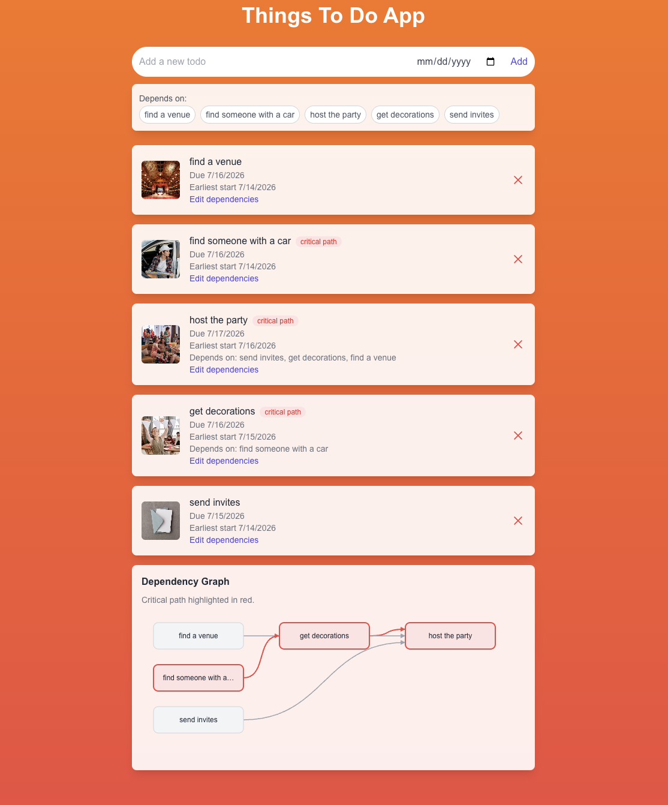

## Soma Capital Technical Assessment

This is a technical assessment as part of the interview process for Soma Capital.

> [!IMPORTANT]  
> You will need a Pexels API key to complete the technical assessment portion of the application. You can sign up for a free API key at https://www.pexels.com/api/  

To begin, clone this repository to your local machine.

## Development

This is a [NextJS](https://nextjs.org) app, with a SQLite based backend, intended to be run with the LTS version of Node.

To run the development server:

```bash
npm i
npm run dev
```

## Task:

Modify the code to add support for due dates, image previews, and task dependencies.

### Part 1: Due Dates 

When a new task is created, users should be able to set a due date.

When showing the task list is shown, it must display the due date, and if the date is past the current time, the due date should be in red.

### Part 2: Image Generation 

When a todo is created, search for and display a relevant image to visualize the task to be done. 

To do this, make a request to the [Pexels API](https://www.pexels.com/api/) using the task description as a search query. Display the returned image to the user within the appropriate todo item. While the image is being loaded, indicate a loading state.

You will need to sign up for a free Pexels API key to make the fetch request. 

### Part 3: Task Dependencies

Implement a task dependency system that allows tasks to depend on other tasks. The system must:

1. Allow tasks to have multiple dependencies
2. Prevent circular dependencies
3. Show the critical path
4. Calculate the earliest possible start date for each task based on its dependencies
5. Visualize the dependency graph

## Solution



All three parts are implemented, plus a unit-test suite for the scheduling logic.

### Part 1: Due Dates

- `Todo.dueDate` (nullable) added to the Prisma schema via migration.
- The add-todo form includes a date picker; the API validates the date and stores it as midnight UTC.
- Each task displays its due date, rendered **red once the due day has ended in the viewer's local calendar** (date-only values are formatted in UTC so the displayed day never shifts across timezones).

### Part 2: Image Previews

- On creation, the server queries the [Pexels API](https://www.pexels.com/api/) with the task title (`lib/pexels.ts`) and stores the first result's URL on the todo.
- The lookup runs in parallel with dependency validation, is bounded by a 3-second timeout, and fails soft — a slow or missing Pexels never blocks task creation.
- The UI shows a spinner while each image loads and a "no image" fallback if the URL dies.

### Part 3: Task Dependencies

- **Multiple dependencies** via a self-referential many-to-many relation on `Todo`, edited from the UI at creation time or later per-task.
- **Circular dependencies are prevented** by DFS reachability (`wouldCreateCycle`) enforced server-side; edits run inside a `Serializable` transaction so concurrent requests cannot race a cycle into the database. Attempts return a 400 with a clear message, surfaced in the UI.
- **Earliest start dates** are computed by topological sort (`computeSchedule`): tasks with no dependencies can start today; every other task starts when its slowest dependency chain finishes (each task is modeled as taking one day, since tasks have no duration field).
- **Critical path** is the longest chain through the DAG, badged on each task in the list and highlighted in red in the graph. When no dependencies exist, there is no critical path.
- **Dependency graph visualization**: a dependency-free SVG renderer — columns are scheduled days (derived from each task's earliest start), arrows show dependencies, and the critical path is drawn in red.

### Running it

```bash
npm i
npx prisma migrate dev   # applies the three migrations
npm run dev
```

Add a Pexels key to `.env` for image previews (optional — everything else works without it):

```
PEXELS_API_KEY="your-key-here"
```

### Tests

`npm test` runs a Vitest suite (24 tests) covering cycle detection, schedule computation, critical-path selection, and input parsing in `lib/graph.ts` / `lib/dependencies.ts`.

Thanks for your time and effort. We'll be in touch soon!
